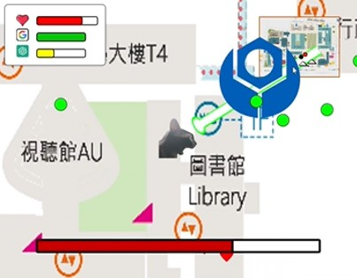

# If 貓咪 study in NTUST #
> [!WARNING]
> 由於檔案龐大，一開始執行須等待片刻，方可遊玩。

## 背景故事 Introduction ##
在一個平行時空的世界裡，台科校園裡的貓咪夢想著成為頂尖學者，她踏入了台灣科技大學，開始了艱辛卻充滿樂趣的大學生活。  
每個學期，小咪都會遇到不同的挑戰，玩家必須利用智慧和策略，通過各種課程要求，並在期末考中脫穎而出。  
最終，玩家將見證小咪順利畢業，邁向她的學術夢想。  
加入這場智慧與努力的冒險，幫助小咪戰勝每一個學期的考驗吧！

## 如何遊玩 How to play ##
1. 玩家需要先選擇就學的貓咪。  
    

2. 貓咪打倒各種敵人，通過每個學期  
  

## 遊戲畫面 Game Screenshot ##
每個學期都會有各式各樣的的敵人，以及期末考Boss。  
     
   - 有些特殊敵人攻擊力低，其的能力會對玩家造成各種影響
     
   - 一旦敵人被擊敗，會遺留下 [肉泥] ，貓咪吃下肉泥能夠恢復生命力
     
   - 每個學期的Boss會越來越強，能力也越來越多，攻擊力也越來越強
     

## 遊玩影片 ##    
  

  

## 如何下載 How to dlownload ##  
 => 請下載完整壓縮檔zip後，執行src.exe，稍待片刻後即可遊玩

## 參考資料 Reference ## 
1. Processing官網：  https://processing.org/  
2. Youtube：[The Coding Train](https://www.youtube.com/@TheCodingTrain)  
3. Youtube： [Chris Whitmire Lessons](https://www.youtube.com/@chriswhitmirelessons220/featured)    
   - [Making platforms for a Player to Jump on in Processing](https://www.youtube.com/watch?v=cmazRYO4_Wc)
   - [Getting a Player to move Left and Right in Processing](https://www.youtube.com/watch?v=jgr31WIYWdk&t=286s)
   - [Getting a Player to Shoot Bullets in Processing](https://www.youtube.com/watch?v=_k_yRbUeVxY)
   - [Destroying Enemies by Shooting them in Processing](https://www.youtube.com/watch?v=UlpjKVKHNio)

4. 素材： [相片來源](Image_Reference.txt)

